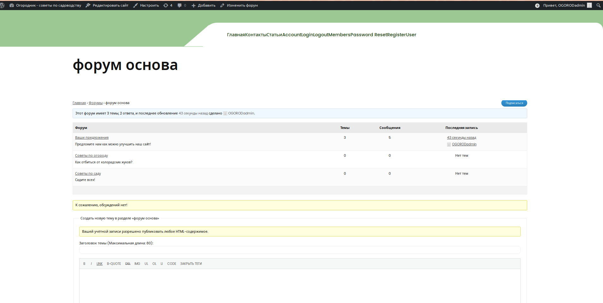
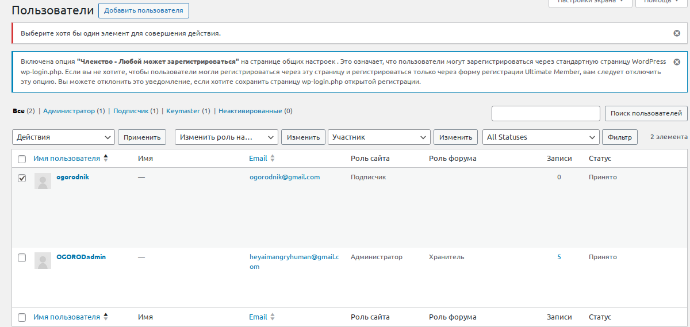
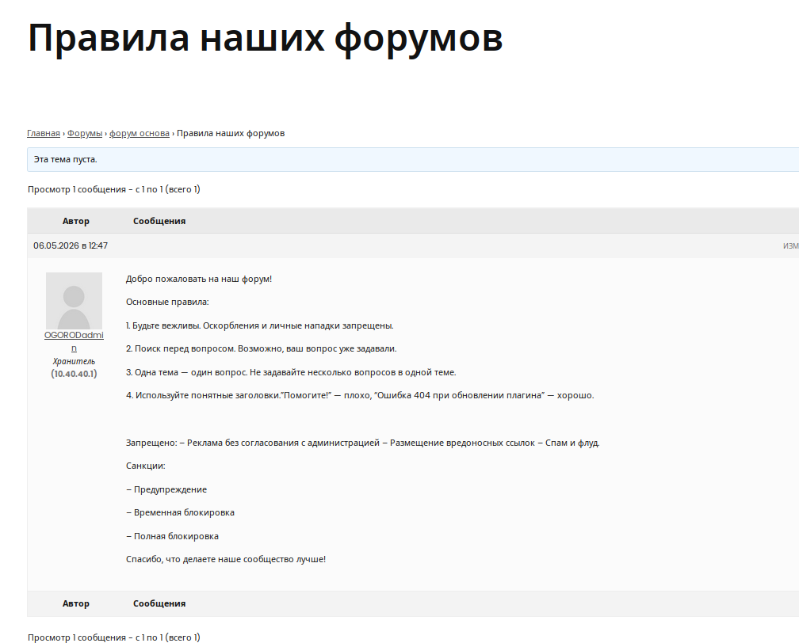

# my-website-project
# /Огородник — советы по садоводству — проект сайта/

**Учебный проект**  
Автор: ZabGit - Пасечникова София
Дата: 28 апреля 2026  
Статус: Визуал готов

---

## /О проекте/

Репозиторий содержит **техническое задание (ТЗ)**, **архитектурные диаграммы** для сайта Огородников и **скриншоты действующих элементов сайта**.

---

## /Файлы/

| Файл | Описание |
|------|----------|
| `Т3 сайта.docx` | Техническое задание (название, аудитория, 5 страниц, функционал, технологии) |
| `Use Case.drawio.png` | Диаграмма прецедентов — кто (гость, пользователь, администратор) и что может делать |
| `Deployment Diagram.drawio.png` | Диаграмма развёртывания — как связаны браузер, сервер (Apache, PHP, MySQL) и GitHub |
| `README.md` | Этот файл |
| `Главная страница сайта с меню.png` | Демонстрация главной страницы сайта |
| `Рабочая форма.png` | Демонстрация работоспособности контактной формы |
| `Страницы в админке.png` | Демонстрация перечня страниц сайта |
| `Страница контакты.png` | Демонстрация страницы сайта с контактной формой |
| `Страница статьи.png` | Демонстрация страницы сайта со списком статей (изображения находятся внутри статей) |
| `кнопка_форума.png` | Демонстрация кнопки, ведущей к странице с форумами (в разделе "контакты") |
| `форумы.png` | Демонстрация наличия форумов |
| `роли.png` | Демонстрация ролей зарегистрированных на сайте пользователей |
| `правила.png` | Демонстрация темы с правилами форумов |

---

Для создания форума был установлен плагин bbPress, создано 4 форума (три рабочих и 1 основной в качестве замены категории, указан как родитель), созданы 3 темы, добавлена кнопка переноса на страницу форума в категорию "контакты", написаны 5 комментариев в форум "Ваши предложения", создана тема с правилами форума.

**/Скриншоты/**

**/Отчёт по тестированию/**

Форум открывается - да
Тема создаётся - да (готовы 3 шт)
Сообщение отправляется - да (5 сообщений в форуме "ваши предложения")
